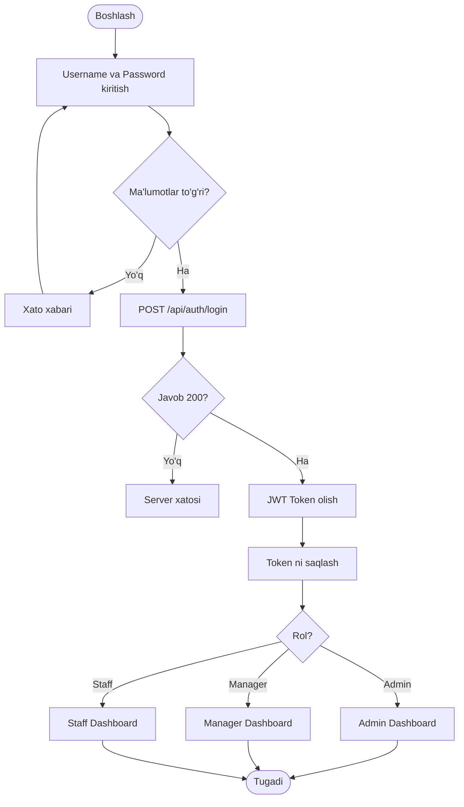

# 📊 CLAUDE AI UCHUN ALGORITM SXEMASI YARATISH BUYRUG'I

## 🎯 BUYRUQ:

```
Men sizdan Room Monitoring (Xonalar Nazorat) mobil ilovasi uchun batafsil algoritm sxemasini Mermaid formatida yaratishingizni so'rayman.

Bu ilova Spring Boot backend va Flutter frontend'dan iborat bo'lib, uchta rol mavjud: Admin, Manager va Staff (Cleaner).

Iltimos, quyidagi flowchart'larni yarating:

---

## 1. LOGIN VA AUTENTIFIKATSIYA ALGORITMI

Quyidagilarni ko'rsating:
- Foydalanuvchi login sahifasiga kiradi
- Username va password kiritadi
- Backend'ga POST /api/auth/login so'rovi yuboriladi
- JWT token generatsiya qilinadi
- Token SharedPreferences'ga saqlanadi
- Rol bo'yicha dashboard'ga yo'naltiriladi (Admin/Manager/Staff)
- Xato hollari (noto'g'ri parol, server xatosi)

---

## 2. ADMIN DASHBOARD ALGORITMI

Admin dashboardining barcha funksiyalari:
- Statistika yuklash (GET /api/statistics/summary)
- Barcha xonalarni ko'rish (GET /api/rooms)
- Staff ro'yxati (GET /api/users?role=STAFF)
- Inventory (buyumlar) nazorati (GET /api/inventory)
- Low stock (kam qolgan buyumlar) ogohlantirish
- Real-time yangilanish
- Filtrlar (status, qavat, vaqt)

---

## 3. MANAGER DASHBOARD ALGORITMI

Manager funksiyalari:
- Menejer uchun umumiy ko'rinish (GET /api/manager/overview)
- Xonalar nazorati (GET /api/rooms)
- Tasklar nazorati (GET /api/tasks)
- Staff baholash (pending approval tasks)
- Task tasdiqlash (PATCH /api/tasks/{id}/approve)
- Xona statusini o'zgartirish

---

## 4. STAFF (CLEANER) DASHBOARD ALGORITMI

Staff ishchi jarayoni:
- Mening vazifalarim (GET /api/tasks/my)
- Xonalar ro'yxati va status
- Vazifani boshlash (task statusini WORKING ga o'zgartirish)
- Tozalash jarayoni
- Rasm yuklash (POST /api/tasks/{id}/photo)
- Vazifani yakunlash (COMPLETED)
- Menejer tomonidan tasdiqlash kutish (PENDING_APPROVAL)
- Ish tarixi va statistika

---

## 5. XONALAR BOSHQARUVI ALGORITMI

Xona lifecycle:
- CLEAN (Toza) → DIRTY (Iflos) → WORKING (Ishlanmoqda) → COMPLETED (Bajarildi) → CLEAN
- Status o'zgartirish (PATCH /api/rooms/{id}/status)
- Xonaga staff biriktirilishi
- Vazifalar avtomatik yaratilishi
- QR code orqali xonani ochish

---

## 6. TASK (VAZIFA) LIFECYCLE ALGORITMI

Vazifa hayot sikli:
- Vazifa yaratiladi (Admin/Manager tomonidan)
- Staff'ga biriktiriladi
- Status: PENDING → WORKING → COMPLETED → PENDING_APPROVAL → APPROVED/REJECTED
- Har bir statusda bajariladigan amallar
- Rasm yuklash talablari
- Vaqt kuzatuvi

---

## 7. INVENTORY (BUYUMLAR) BOSHQARUVI ALGORITMI

Buyumlar nazorati:
- Buyumlar ro'yxati (GET /api/inventory)
- Kategoriya bo'yicha filter
- Low stock ogohlantirish (quantity < minRequired)
- To'ldirish so'rovi (POST /api/inventory/{id}/request)
- Admin tomonidan tasdiqlash
- Buyum hisobi yangilanishi

---

## 8. REAL-TIME YANGILANISH ALGORITMI

FCM Push Notification:
- FCM token olish va serverga yuborish
- Topic subscription (admin, manager, staff)
- Yangi vazifa haqida xabar
- Vazifa tasdiqlandi/rad etildi xabari
- Inventory kam qoldi ogohlantirish
- Background va foreground notification handling

---

## 9. LOGOUT ALGORITMI

Chiqish jarayoni:
- Logout tugmasi bosiladi
- Confirmation dialog
- AuthProvider.logout() chaqiriladi
- Token va user data o'chiriladi
- FCM topic'lardan unsubscribe
- Navigation stack tozalanadi
- Login sahifasiga qaytish

---

## 10. XATO VA EXCEPTION HANDLING ALGORITMI

Xatolarni boshqarish:
- Network xatolari (no internet, timeout)
- Server xatolari (500, 502, 503)
- Authentication xatolari (401, 403)
- Validation xatolari (400)
- Retry mexanizmi
- User-friendly xabar ko'rsatish
- Error logging

---

## FORMATLAR:

1. **Mermaid Flowchart** formatida yozing
2. Har bir flowchart uchun alohida blok yarating
3. Decision point'larni rhombus (◇) shaklida ko'rsating
4. Process'larni rectangle (▯) shaklida ko'rsating
5. API endpoint'larni yashil rangda ko'rsating
6. Xato hollarini qizil rangda ko'rsating
7. O'zbek tilida izohlar qo'shing

---

## QO'SHIMCHA TALABLAR:

- Har bir algoritm uchun:
  * Boshlang'ich nuqta (Start)
  * Asosiy jarayon
  * Decision point'lar (if/else)
  * API chaqiruvlar
  * Ma'lumot saqlash (SharedPreferences, State)
  * Tugash nuqtasi (End)
  * Xato holatlari
  
- Parallel jarayonlarni ko'rsating
- Async operatsiyalarni belgilang
- User interaction point'larni ko'rsating

---

## MISOL FORMAT:



Har bir algoritm uchun shunga o'xshash batafsil flowchart yarating.
```

---

## 📋 QISQACHA VERSIYA (Copy-paste uchun):

Agar yuqoridagi buyruq juda uzun bo'lsa, quyidagi qisqa versiyani ishlating:

```
Room Monitoring mobil ilovasi uchun quyidagi algoritm sxemalarini Mermaid flowchart formatida yarating:

1. Login va JWT autentifikatsiya
2. Admin dashboard (statistika, xonalar, staff, inventory)
3. Manager dashboard (overview, tasks, approval)
4. Staff dashboard (my tasks, tozalash, rasm yuklash)
5. Xonalar lifecycle (CLEAN → DIRTY → WORKING → COMPLETED)
6. Task lifecycle (PENDING → WORKING → COMPLETED → APPROVED)
7. Inventory boshqaruvi (low stock, refill request)
8. FCM push notification
9. Logout jarayoni
10. Exception handling

Har bir flowchart'da:
- API endpoint'lar
- Decision point'lar
- Xato holatlari
- User interaction
- O'zbek tilida izohlar

Mermaid flowchart formatida, batafsil, step-by-step ko'rsating.
```

---

## 🎨 CLAUDE'GA YUBORISH:

1. Claude AI ni oching
2. Yuqoridagi buyruqni **to'liq copy** qiling
3. Claude'ga paste qiling
4. Enter bosing
5. Claude sizga har bir algoritm uchun batafsil Mermaid flowchart yaratadi

---

## 💡 QO'SHIMCHA BUYRUQLAR:

Agar biror algoritm tushunarsiz bo'lsa:

```
[Algoritm nomi] uchun yanada batafsil, har bir qadamni alohida ko'rsatuvchi flowchart yarating. Backend API chaqiruvlari, Flutter widget lifecycle, va state management'ni ham qo'shing.
```

Agar vizual ko'rinish kerak bo'lsa:

```
Bu flowchart'ni PNG yoki SVG formatda eksport qilish uchun kod bering.
```

---

## 📊 NATIJA:

Claude sizga:
- ✅ 10 ta batafsil Mermaid flowchart
- ✅ Har bir funksiya ketma-ketligi
- ✅ API endpoint'lar
- ✅ Decision logic
- ✅ Xato handling
- ✅ O'zbek tilida izohlar

beradi va siz buni Mermaid Live Editor (https://mermaid.live) da ochib, PDF/PNG ga export qila olasiz!

---

**Muvaffaqiyatlar! 🎉**
